测试纯文字：
测试

测试标题###：
### 测试

测试标题##：
## 测试

测试标题#：
# 测试

测试代码块： 
```yaml
yum install
```

测试本地图片：


测试本地图片：
[img](https://tse2-mm.cn.bing.net/th/id/OIP-C.sM4IE-0sfN9ICstIElrXNQHaF4?pid=ImgDet&rs=1)

测试引用：
> 测试

测试加粗**：
**测试**

测试无序列表-：
- 测试1
- 测试2

测试有序列表1.：
1. 测试1
2. 测试2

测试斜体*：
*测试*

测试斜体_：
_测试


### esxi安装vgpu驱动

**设置显卡禁止直通**
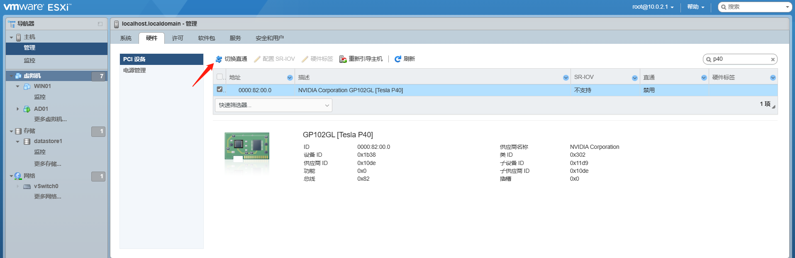

**上传驱动vib文件**
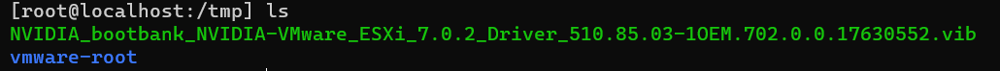

**进入维护模式**
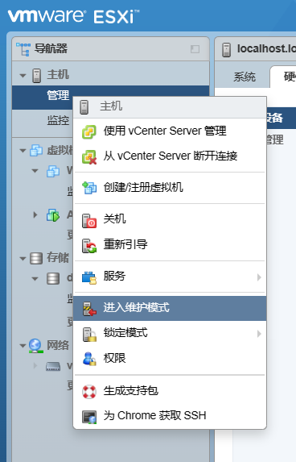

**设置读写权限**
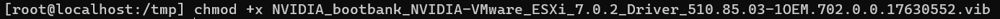

**安装驱动**
```yaml
esxcli software vib install -v (vib文件路径) ---安装驱动
esxcli software vib update -v (vib文件路径) ---更新驱动
```
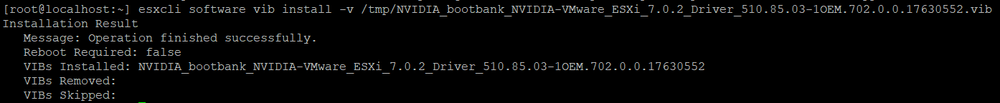

**验证驱动**
```bash
nvidia-smi
nvidia-smi -e 0 ---若ECC不为OFF
```
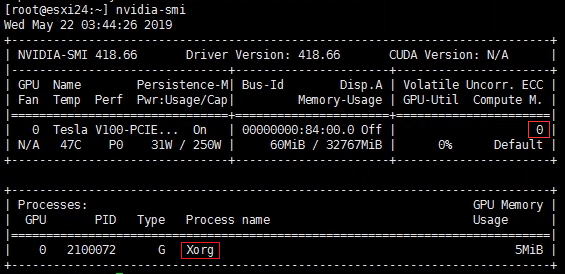
**若红框为Xorg**
**设置显卡共享类型**
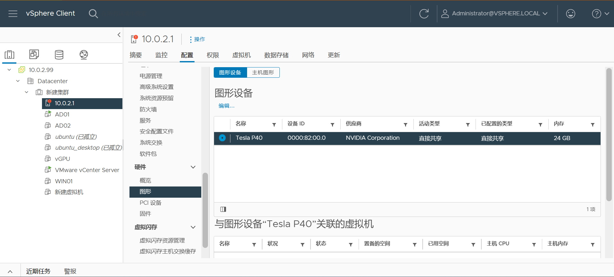

**切换直接共享**
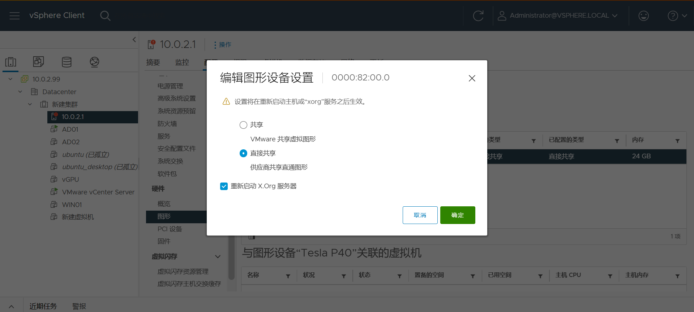

**再次验证驱动，如图即可**
```bash
nvidia-smi
lspci | grep NVIDIA
```

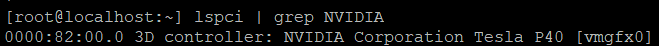

### 安装授权服务器licserve
**lic版本对照表**
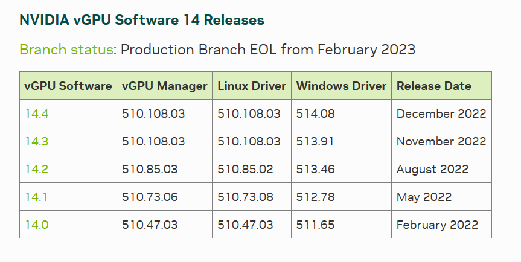

**配置CentOS虚拟机**
```bash
8a:50:13:0c:ae:06 ---修改虚拟网卡MAC
2018-07-19 18:40:00 ---修改系统时间并关闭ntp同步
yum update -y ---更新系统
yum intsall java -y ---安装java
yum install tomcat tomcat-webapps -y ---安装tomcat 
```

**本机上传安装文件到虚拟机**
```bash
scp setup.bin root@IP:文件夹
```
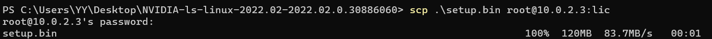

**验证上传**
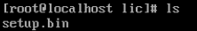

**安装licserve**
```bash
./setup.bin ---运行安装文件
/usr/share/tomcat ---提示输入tomcat路径时输入默认路径
```
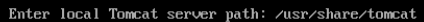

**服务设置**
```bash
systemctl stop firewalld ---停止防护墙
systemctl disable  firewalld  ---禁用防火墙自启服务
systemctl start tomcat.service ---启动tomcat服务
systemctl enable tomcat.service ---设置tomcat服务自启
systemctl status tomcat.service ---查看服务状态
systemctl list-unit-files ---查看所有自启服务  we前后 q退出
```

**验证授权服务器**
```bash
http://ip:8080/licserver ---浏览器进入管理页面
```
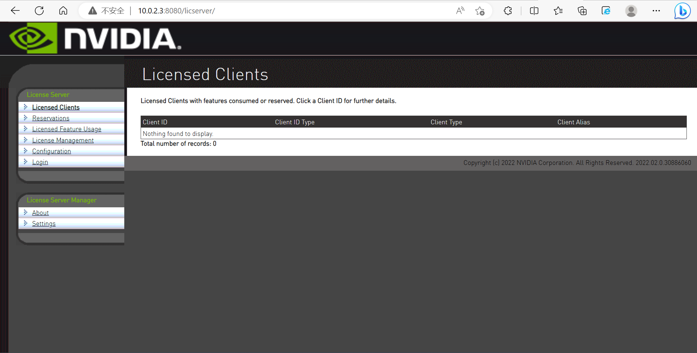

**导入vib授权文件**
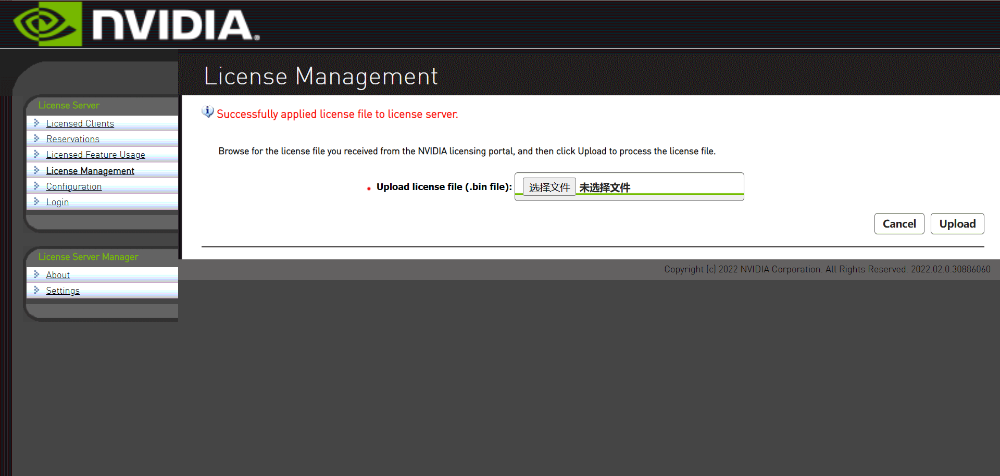

**验证授权**
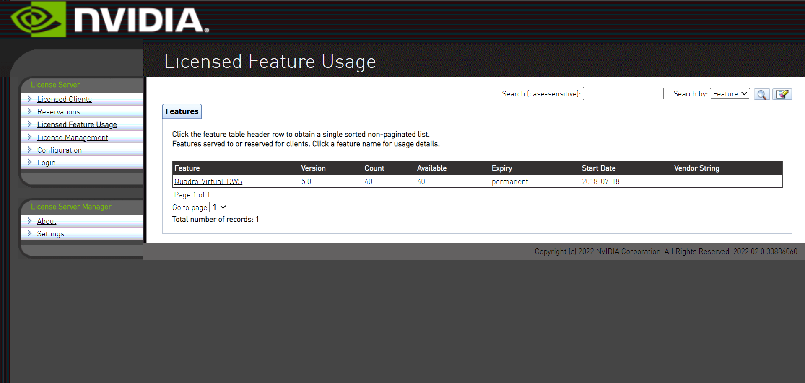

**授权服务器打开NTP自动同步**
```bash
yum -y install chrony ---安装软件
systemctl enable chronyd  ---开机自启
systemctl start chronyd ---启动
timedatectl status ---查看时间同步状态
timedatectl set-ntp true ---开启网络时间同步
date ---查看系统时间是否正确
```

**下载对应的guid驱动，并安装**
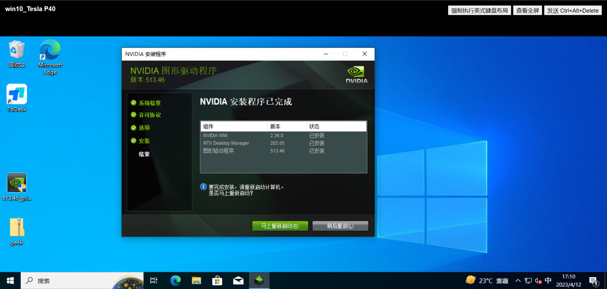


**进入驱动面板，输入授权服务器ip及7070授权端口**
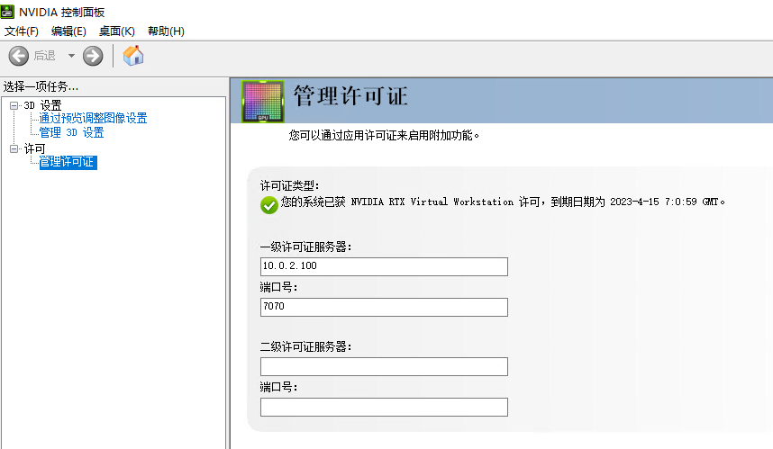

**管理面板验证授权成功**
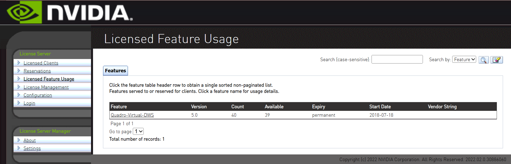
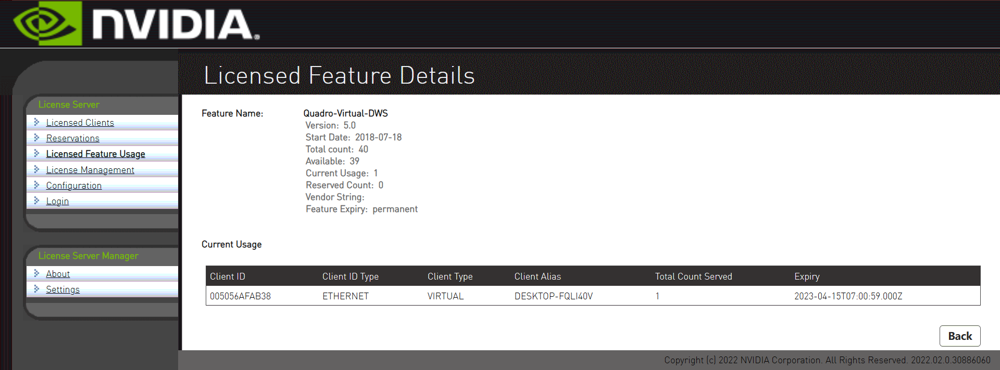
